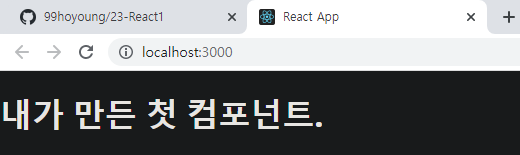
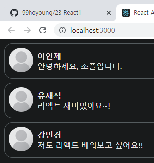
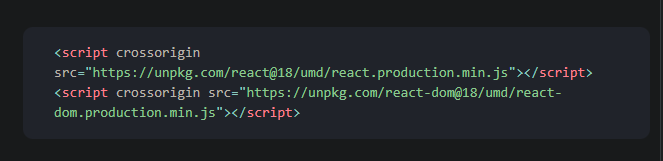
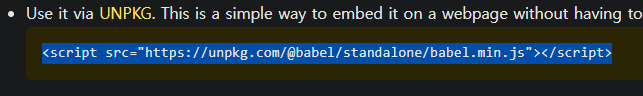
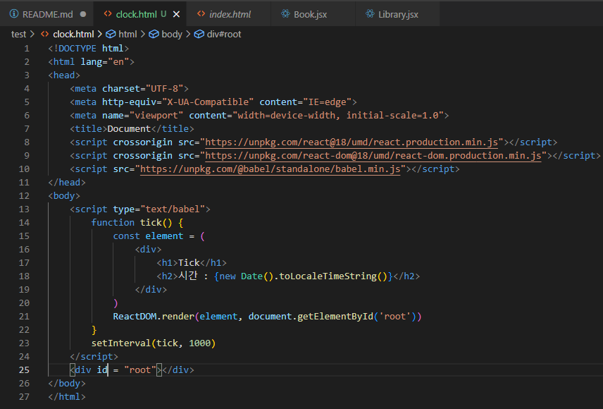
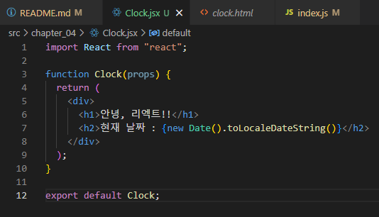
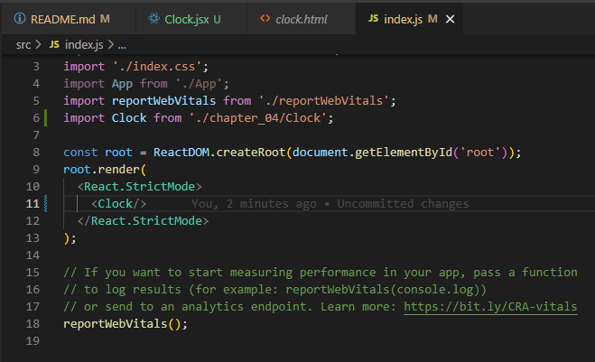
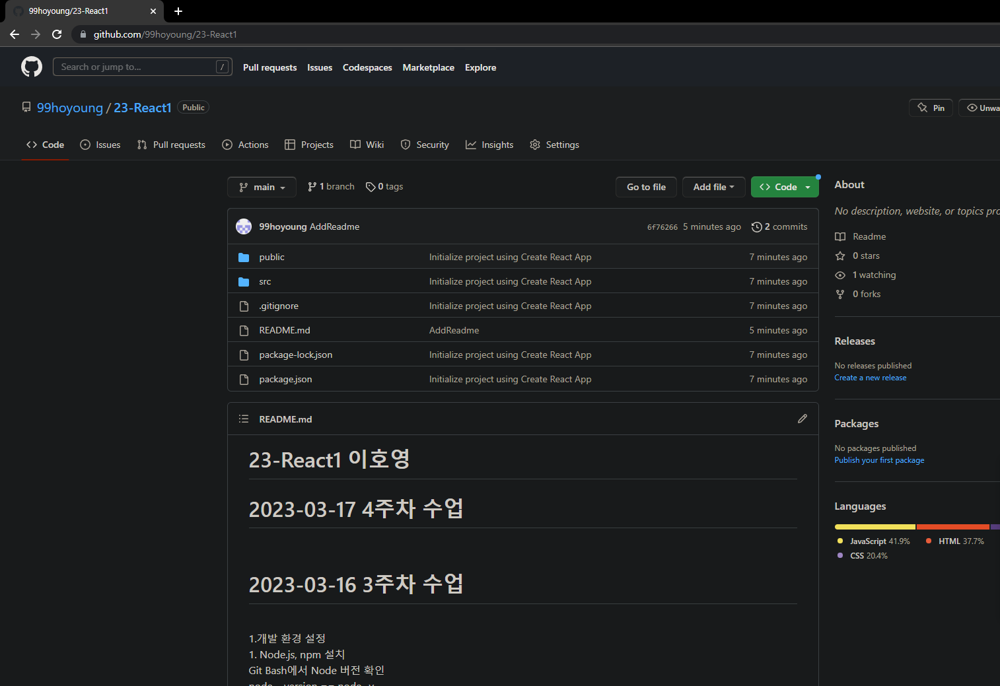

# 23-React1 이호영

<h1>2023-04-27 9주차 수업</h1><br>
이벤트 핸들링 
- Dom 클릭 이벤트 처리, React 클릭 이벤트 처리가 있음
- React 클릭 이벤트는 이벤트의 이름이 onclick에서 onClick으로 변경 
- React 클릭 이벤트는 젼댤하려는 함수는 문자열에서 함수 그대로 전달한다.

이벤트 헨들러 추가 방법
- 버튼 클릭 시 이벤트 헨들러 함수인 handleClick()호출
- bind 미사용시 this.handleClick은 클로벌 스코프에서 호출되어, undefined로 사용불가 하기 때문
- bind 미사용 시 화살표 함수를 사용하여도 된다.(거의 사용하지는 않음)


클래스형을 함수형으로 바꾸려면
- 함수 안에 함수로 정의
- arrow function을 사용하여 정의
- 함수형에서는 this를 사용하지 않고, onClick에서 바로 HandleClick을 넘기면 된다.

Arguments 전달하기
- 함수를 정의할 때는 파라미터(매개변수) 혹은 아귀먼트(인자) 라고 부른다.
- 이벤트 헨들러에 매개변수를 전달해야 하는 경우도 많다.
- event라는 매개변수는 리액트의 이벤트 객체를 의미한다

인라인 조건
1. 인라인 if
- if문을 직접 사용하지 않고, 동일한 효과를 내기 위해 && 논리 연산자를 사용한다.
- &&는 and연자로 모든 조건이 참 일 떄만 참이 된다.
- 첫 번째 조건이 거짓이면 두 번째 조건은 판단할 필요가 없다.(단축 평가)

2. 인라인 if-else
- 삼항 연산자를 사용한다.
- 문자열이나 엘리먼트를 넣어서 사용할 수도 있다.

<h1>2023-04-13 7주차 수업</h1><br>

### 훅
- 리액트의 state와 생명주기 기능에 갈고리를 걸어 원하는 시점에 정해진 함수를 실행되도록 만든 것
- 클래스형 컴포넌트에서는 생성자에서 state를 정의하고, setState() 함수를 통해 state를 업데이트합니다.
- Hook이란 state와 생명주기 기능에 갈고리를 걸어 원하는 시점에 정해진 함수를 실행되도록 만든 함수를 의미합니다.
---
### useState

- state를 사용하기 위한 훅
- 함수 컴포넌트에서는 기본적으로 state라는 것을 제공하지 않음
- 클래스 컴포넌트처럼 state를 사용하고 싶으면 useState()훅을 사용해야 함
    
    사용법
    
    ```jsx
    const [변수명, set함수명] = useState(초깃값);
    ```
    
---
### useEffect

- 사이드 이펙트를 수행하기 위한 훅
- 사이드 이펙트란 서버에서 데이터를 받아오거나 수동으로 DOM을 변경하는 등의 작업
- useEffect() 훅만으로 클래스 컴포넌트의 생명주기 함수들과 동일한 기능을 수행할 수 있음
    
    사용법
    
    ```jsx
    useEffect(이펙트 함수, 의존성 배열);
    ```
    
- 의존성 배열 안에 있는 변수 중에 하나라도 값이 변경되었을 때 이펙트 함수가 실행됨
- 의존성 배열에 빈 배열([])을 넣으면 마운트와 언마운트시에 단  한 번씩만 실행됨
- 의존성 배열 생략 시 컴포넌트가 업데이트될 때마다 호출됨
- 선언된 컴포넌트의 props와 state에 접근할 수 있음
- useEffect()에서 리턴하는 함수는 컴포넌트 마운트가 해제될 때 호출됨
---
## useMemo

- Memoized value를 리턴하는 훅
- 연상량이 높은 작업이 매번  렌더링될 때마다 반복되는 것을 피하기 위해 사용
- 렌더링이 일어나는 동안 실행되므로 렌더링이 일어나는 동안 실행돼서는 안될 작업을 useMemo()에 넣으면 안 됨
    
    사용법
    
    ```jsxㄴ
    const memoizedValue = useMemo(값 생성 함수, 의존성 배열)
    ```
    
- 의존성 배열에 들어있는 변수가 변했을 경우에만 새로 값 생성 함수를 호출하여 결과값을 반환함
- 그렇지 않은 경우에는 기존 함수의 결과값을 그대로 반환함
- 의존성 배열을 넣지 않을 경우 렌더링이 일어날 때마다 매번 값 생성 함수가 실행되므로 의미가 없음
---
### useCallback

- useMemo() 훅과 유사하지만 값이 아닌 함수를 반환하다는 점이 다름
- 컴포넌트 내에 함수를 정의하면 매번 렌더링이 일어날 때마다 함수가 새로 정의되므로 useCallback() 훅을 사용하여 불필요한 함수 재정의 작업을 없애는 것
    
    사용법
    
    ```jsx
    const memoizedCallback = useCallback(콜백 함수, 의존성 배열);
    ```
    
- 의존성 배열에 들어있는 변수가 변했을 경우에만 콜백 함수를 다시 정의해서 리턴함
---
### useRef

- 레퍼런스를 사용하기 위한 훅
- 레퍼런스란 특정 컴포넌트에 접근할 수 있는 객체를 의미
- 매번 렌더링될 때마다 항상 같은 레퍼런스 객체를 반환
    
    사용법
    
    ```jsx
    const refContainer = useRef(초깃값);
    ```
    
---
## 훅의 규칙

무조건 최상위 레벨에서만 호출해야 함

- 반복문이나 조건문 또는 중첩된 함수들 안에서 훅을 호출하면 안 됨
- 컴포넌트가 렌더링될 때마다 매번 같은 순서로 호출되어야 함

리액트 함수 컴포넌트에서만 훅을 호출해야 함

- 훅은 리액트 함수 컴포넌트에서 호출하거나 직접 만든 커스텀 훅에서만 호출할 수 있음
---
### 커스텀 훅

- 이름이 use로 시작하고 내부에서 다른 훅을 호출하는 단순한 자바스크립트 함수
- 파라미터로 무엇을 받을지, 어떤 것을 리턴해야 할지를 개발자가 직접 정할 수 있음
- 중복되는 로직을 커스텀 훅으로 추출하여 재사용성을 높이기
- 이름이 use로 시작하지 않으면 특정 함수의 내부에서 훅을 호출하는지를 알 수 없기 때문에  훅의 규칙 위반 여부를 자동으로 확인할 수 없음


<h1>2023-04-06 6주차 수업</h1><br>

### 컴포넌트 추출
- 복잡한 컴포넌트는 여러개의 컴포넌트로 나눌 수 있음.
- 큰 컴포넌트에서 일부를 추출해 새로운 컴포넌트를 만듦.
- Comment는 댓글 표시 컴포넌트

### 컴포넌트 만들기 실습예제
```js
import React from "react";

function Comment(props) {
    return (
        <div>
            <h1>내가 만든 첫 컴포넌트.</h1>
        </div>
    )
}

expect default Comment
```

### 컴포넌트 리스트 만들기 실습예제
```js
import React from "react";
import Comment from "./Comment"

function CommentList(props) {
    return (
        <div>
            <Comment />
        </div>
    )
}

export default CommentList
```

### index.js 수정
```js
import React from 'react';
import ReactDOM from 'react-dom/client';
import './index.css';
import App from './App';
import reportWebVitals from './reportWebVitals';
import CommentList from './chapter_05/CommentList';

const root = ReactDOM.createRoot(document.getElementById('root'));
root.render(
  <React.StrictMode>
    <CommentList/>
  </React.StrictMode>
);
reportWebVitals();
```
### 결과물
- 

### CSS코드 작성, 소스전달 코드 작성
```js
 function Comment(props) {
    return (
        <div style={styles.wrapper}>
            <div style={styles.imageContainer}>
                
            </div>

            <div style={styles.contentContainer}>
                <span style={styles.nameText}>{props.name}</span>
                <span style={styles.commentText}>{props.Comment}
                </span>
            </div>
        </div>
    )
}
```

```js
import React from "react";
import Comment from "./Comment";

const comments = [
  {
    name: "이인제",
    comment: "안녕하세요, 소플입니다.",
  },
  {
    name: "유재석",
    comment: "리액트 재미있어요~!",
  },
  {
    name: "강민경",
    comment: "저도 리액트 배워보고 싶어요!!",
  },
];

function CommentList(props) {
  return (
    <div>
      {comments.map((comment) => {
        return <Comment name={comment.name} comment={comment.comment} />;
      })}
    </div>
  );
}

export default CommentList;
```
### map함수
- 여러개의 Comment를 하나씩 빼서 사용.

### 결과물


### state란?
- State는 리액트 컴포넌트의 상태를 의미
- 상태의 의미는 정상인지 비정상인지가 아니라 컴포넌트의 데이터를 의미
- 컴포넌트의 변경가능한 데이터를 의미
- state가 변하면 다시 렌더링 되기 때문에 렌더링과 관련된 값만 state에 포함시켜야함.

### state의 특징
- 리액트 만의 특별한 형태가 아닌 자바스크립트 객체일 뿐이다.

###
<h1>2023-03-30 5주차 수업</h1><br>

### 엘리먼트 정의
- 엘리먼트는 리액트 앱을 구성하는 요소
- 웹사이트 경우 DOM 엘리먼트이며 HTML요소를 의미
  
### 엘리먼트와 DOM엘리먼트 차이
- 리엑트 엘리먼트는 Virtual DOM 형태를 취함
- DOM 엘리먼트는 페이지의 모든 정보를 갖고 있어 무겁다.
- 반면 리액트 엘리먼트는 변화한 부분만 갖고 있어 가볍다.

### 엘리먼트의 생김새
- 리액트 엘리먼트는 JSP 객체의 형태로 존재
- 컴포넌트, 속성 및 내부의 childern을 포함하는 일반 JS객체
- 이 객체는 마음대로 변경할 수 없는 불변성을 가짐.

### DOM 엘리먼트를 사용하여 현재시간 출력(1초마다 초기화)
1. 폴더 만들고 html 파일 만들기
2. react 사이트에서 코드 복붙 
3. babel/standalone 사이트 코드 복붙 
4. 코드 작성 

### 실습
- 
- 

### Props의 개념
- props는 prop(property : 속성 특성)의 준말
- props는 컴포넌트의 속성
- 컴포넌트에 어떠한 속성, props를 넣느냐에 따라 다른 엘리먼트 출력
- props는 컴포넌트에 전달 할 다양한 정보를 다모 있는 JSP객체

### Props의 특징
- 읽기 전용, 변경할 수 없음
- 속성이 다른 엘리먼트를 생성하려면 새로운 props를 컴포넌트에 전달해야됨.

### Props 사용법
- JSX에서는 key-value쌍으로 props를 구성

<h1>2023-03-23 4주차 수업</h1><br>

### github repositories 새로 만들기
  1. README.md 백업
  2. local에 있는 저장소 이름 바꾸기/삭제
  3. 새 프로젝트 생성(23-React1)
  4. README.md 덮어쓰기
  5. GitHub 저장소 삭제
  6. 로컬에서 23-React1 push
  7. GitHub 저장소 확인 <br>
    <br>
### 명령어
- git init
- git remote add origin 깃허브 내주소
- git commit -m "멘트"
- git branch -M main
- git push origin main 

### JSX란?
- JavaScript에 XML을 추가한 확장 문법
- JSX는 XML/HTML 코드를 자바스크립트로 변환
- React가 createElement 함수를 사용하여 자동으로 자바스크립트로 변환해줌

### JSX의 장점
- 코드가 간결해짐.
- 가독성이 향상됨.
- Injection Attack 해킹 방법을 방어함으로서 보안에 강함.

### JSX 사용법
- 모든 자바스크립트 문법 지원.
- 자바스크립트 문법에 XML/HTML을 섞어 사용.
- HTML/XML에 자바스크립트 코드를 사용할시 {}괄호를 사용.
   
<h1>2023-03-16 3주차 수업</h1><br>
1.개발 환경 설정 <br>
1. Node.js, npm 설치 <br>
   
Git Bash에서 Node 버전 확인<br>
node --version == node -v<br>
npm -v<br>

### 1. React(리액트) 
- 사용자 인터페이스를 만들기 위한 자바스크립트 라이브러리<br>
### 2. React 장점 
- 빠른 업데이트와 렌더링 속도<br>

### 3. 컴포넌트 기반 구조<br>
- file 이름 컴포넌트 이름과 동일하게<br>
- Pascal Case - 첫번째 문자는 대문자<br>
- camel Case - 각 단어의 첫문자를 대문자로 표기하되, 맨처음 문자는 소문자<br>
- 리액트의 모든 페이지는 컴포넌트로 구성
- 컴포넌트를 조합해서 웹사이트를 개발

### 4. 재사용성
- 반복적인 작업을 줄여줘 생산성을 높임
- 유지보수 용이
- 재사용이 가능 하면 해당 모듈의 의존성X

### 5. npx 설치
- 내 폴더에 my-app 설치<br>
- npx create-react-app my-app 


<hr>
2023-03-11수업 2주차<br>
1.깃허브 설치<br>
2.깃허브 가입<br>
레파지토리생성(23-React1)<br>
+버튼을 눌러버렸을 상태로 변경> commit 확인여부 확인 후 깃에 올라감.<br>
commit 사용 이유 > 지금 까지 했던 작업을 잊지 않기 위해 <br>
(어떤 시점에서 어느 파일을 adding 했는가를 확인 하기 위해 commit)<br>
commit comment는 50byte가 원칙 <br>
폴더 디렉토리 들어가서 git clone (복사 링크 붙여넣기)<br>

1. 이호영 <br>
2. 2023-03-16 <br>
3. 학습 내용(필수) : h2이하 사이즈 자유 사용 <br>
4. 작성 코드(선택) <br>
5. 최근 내용이 위에 오도록 작성 <br>
6. 날자 별 구분이 잘 가도록 작성
>>>>>>> 3996c6c43d88c4775b8de747e1021d0853b5a362
